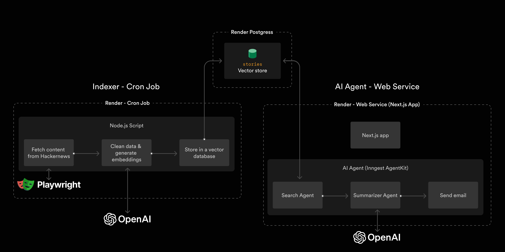
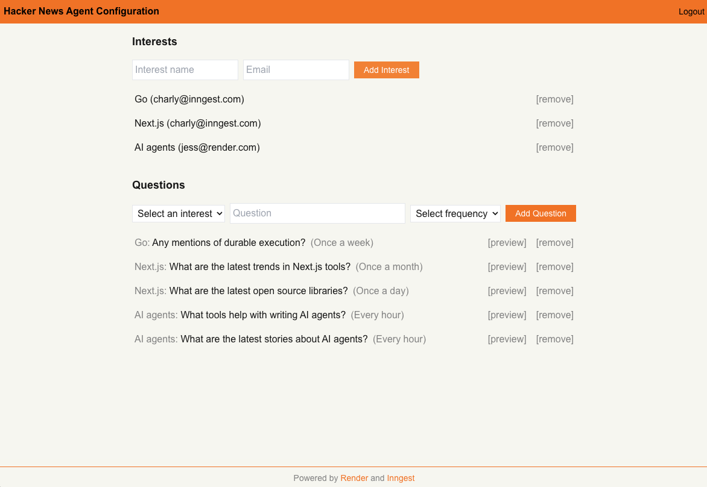

# Hacker News Agent with Render and Inngest

<p align="center">



</p>

<p align="center">
    <a href="https://www.render.com/docs/">Render docs</a>
    <span>&nbsp;·&nbsp;</span>
    <a href="https://agentkit.inngest.com/overview?ref=render-hacker-news-agent-repository">Inngest Agent Kit docs</a>
</p>
<br/>

Learn how to build and deploy a Hacker News agent with Inngest, Render, and Next.js.

## What the agent does
This Hacker News Agent periodically generates a summary of popular articles on Hacker News, and emails you a report.

To use it, you:
- Specify _questions_ you want answered about specific _interests_.

    For example, you can specify "Next.js" as an interest, and ask "What are the latest open source libraries?"
- Specify the _frequency_ at which you want summaries for each question. (E.g. every hour, once a day, once a week)

The Agent will do the rest.



## Table of contents
- [Project structure](#project-structure)
- [Prerequisites](#prerequisites)
- [Deploy this project on Render](#deploy-this-project-on-render)
- [Modify or run the project locally](#modify-or-run-the-project-locally)

## Project structure

- `packages/indexer`: A cron job that indexes Hacker News content into a vector database.

    This job is deployed using a [Render Cron Job](https://render.com/docs/cronjobs), and the vector database is a Render PostgreSQL database that has the [`pgvector` extension enabled](https://render.com/docs/postgresql-extensions).
- `packages/app`: A web app that includes the UI to configure topics and questions for the Hacker News agent, and the backend logic for the agents.

   This app is written in Next.js and hosted as a [web service](https://render.com/docs/web-services) on Render. The app uses [Inngest's AgentKit](https://agentkit.inngest.com/overview) to create and orchestrate agents. To use Inngest's terminology, we'll refer to the combination of routing logic, agents, and tools as the _AgentKit Network_.

## Prerequisites
### Accounts
To run this project, you need the following accounts:

- [Render account](https://render.com/?utm_source=inngest-hn-agent-repo): host and scale web applications
- [Inngest account](https://inngest.com/?ref=render-hacker-news-agent-repository): workflow and agent orchestration
- [OpenAI account](https://platform.openai.com/): API for LLM
- [Resend account](https://resend.com/): API to send email

### Github code
Before you get started, please fork this repo. By having your own copy of the repo, you can freely make changes to it.

Then git clone your forked repo to your local machine.

## Deploy this project on Render

### 1. Set up the PostgreSQL vector database

#### What it's for
The PostgreSQL database is used to store Hacker News stories. It serves as the vector database for the AgentKit Network.

#### Steps
To set up this database, we'll create a new PostgreSQL database on Render, enable the `pgvector` extension on the database, and initialize it with our project's schema.

Follow these steps:

1. [Create a Project on Render](https://render.com/docs/projects#setup). Name it "Hacker News Agent".

2. [Create a new PostgreSQL database on Render](https://render.com/docs/postgresql-creating-connecting#create-your-database).

    - For the "Project", specify the project you created in Step 1.
    - For the "Instance Type", you may use the Free plan.

3. Enable the pgvector extension and initialize the database with the project's schema.

    - 3.1. Locate the `schema.sql` file in this repo. (This file contains the commands to enable the pgvector extension and set up this project's schema.)
    - 3.2. Copy your database's [external database URL](https://render.com/docs/postgresql-creating-connecting#external-connections) from the Render dashboard.
    - 3.3. Run the following command in your terminal from the root of the project, but replace the dummy PostgreSQL URL with your URL from Step 3.2:

      ```bash
      psql -Atx postgresql://<redacted>@<redacted>.render.com/<redacted> -f packages/indexer/schema.sql
      ```

### 2. Set up the Indexer cron job

#### What it's for
The Indexer service fetches Hacker News stories and stores them in the PostgreSQL vector database.

#### Steps

We will set up the Indexer service as a cron job on Render. (Render offers a Cron Job service type.)

This cron job is packaged as a Docker image that is configured with Playwright and its Chromium binary. For your convenience, we've made this Docker image publicly available on Docker Hub.

1. Create a new cron job on Render [using these instructions](https://render.com/docs/cronjobs#setup).
    1. Choose the **Existing image** option and provide the following **Image URL**: `docker.io/wittydeveloper/inngest-render-indexer:0.6`.
    2. Configure the **Schedule** to run on an hourly basis: `0 * * * *`.
    3. Configure the following environment variables:
       - `DATABASE_URL`: The _internal URL_ of your PostgreSQL database ([here's how to find it](https://render.com/docs/postgresql-creating-connecting#internal-connections)).
       - `OPENAI_API_KEY`: Your OpenAI API key.
2. (optional) To see a sample run, [manually trigger a run](https://render.com/docs/cronjobs#manually-triggering-a-run) of your cron job. Note that the cron job will not fetch any stories from Hacker News yet. You'll need to set up the Next.js app (next step), and specify some "interests" to track via the app's UI.

#### About the code
The Docker image is built from the `Dockerfile` at the root of this project.

See the `packages/indexer` directory for the source code.

### 3. Set up the Next.js app with AgentKit Network

#### What it's for
The Next.js app serves the UI that lets you configure the Hacker News agent with "interests" you want to track. The app's backend hosts the logic of the AgentKit Network.

#### Steps

To set up the app, we'll create a new web service on Render and configure it to run the Next.js application. The code is located in the `packages/app` directory.

1. Create a new web service on Render [using these instructions](https://render.com/docs/web-services#deploy-from-github--gitlab--bitbucket).
    1. Choose the **Git provider** option, and select the GitHub repo you forked. Click **Connect**.
    2. In the service creation form, provide the following details:
        | Field | Value|
        |---|---|
        | Language | Node |
        | Root Directory | `packages/app/` |
        | Build Command | `pnpm install; pnpm build` |
        | Start Command | `pnpm start` |

    3. Configure the following environment variables:
        - `DATABASE_URL`: The _internal URL_ of your PostgreSQL vector database ([here's how to find it](https://render.com/docs/postgresql-creating-connecting#internal-connections)).
        - `INNGEST_EVENT_KEY`: The [Event Key of your Inngest project](https://www.inngest.com/docs/events/creating-an-event-key?ref=render-hacker-news-agent-repository).
        - `INNGEST_SIGNING_KEY`: The [Signing Key of your Inngest project](https://www.inngest.com/docs/platform/signing-keys?ref=render-hacker-news-agent-repository).
        - `OPENAI_API_KEY`: Your OpenAI API Key.
        - `RESEND_API_KEY`: Your Resend API Key.
        - `APP_PASSWORD`: A custom password. You must enter this password to gain access to your app.
2. Click **Deploy Web Service**.

After the deploy finishes, your service will be accessible at the `onrender.com` URL displayed in the dashboard.

### 4. Sync the Inngest app

Each time you deploy a new app that uses Inngest, or update your Inngest functions, you must [sync  the app](https://www.inngest.com/docs/apps/cloud) with Inngest.

Inngest offers several ways to sync an app. Here, we'll sync the app manually through the Inngest dashboard.

1. Open your Inngest dashboard.
2. Click **Sync new app** (or [visit this link](https://app.inngest.com/env/production/apps/sync-new)).
3. Choose the **Sync manually** option, and provide the following app URL: `https://<your-app-name>.onrender.com/api/inngest`
4. Click **Sync app**.

### 5. Try it out!

You're now ready to try out your Hacker News Agent.

1. Go to your Render Web Service dashboard and click on the URL of your web service (ex: https://agenkit-render-tutorial.onrender.com).
2. Log into your app using the `APP_PASSWORD` you specified. You'll then see the homepage.
3. Add an interest and an email address where you want email updates to be sent. Then add a question for your Hacker News Agent to answer for you and specify the frequency at which you want the Agent to update you. <br/>


4. [Manually trigger a run](https://render.com/docs/cronjobs#manually-triggering-a-run) of your Indexer cron job.
    - In the cron job's logs, you'll see a log line for each Hacker News story that's stored into the database. <br/>
    

5. Try out the app. You can sit back and wait for the next time your Agent runs, which will be determined by the frequency you specified for your question(s). If you want an instant result, click "[ preview ]" next to any question in the UI. 

## Modify or run the project locally

Install dependencies by running the following command from the root of the project:

```bash
pnpm install
```

### Indexer (`packages/indexer`)

**Run the indexer locally**

> Note: You'll need to set up the `.env.local` file.

```bash
pnpm build

pnpm start
```

**Push a new Docker image version**

Example:

```bash
docker build -t docker.io/wittydeveloper/inngest-render-indexer:0.5 .
docker push docker.io/wittydeveloper/inngest-render-indexer:0.5
```

### Next.js app (`packages/app`)

> Note: You'll need to set up the `.env.local` file.
> Don't forget to set the `APP_PASSWORD` password

**Run the Next.js app locally**

```bash
pnpm dev
```

**Start the Inngest Dev Server**

```bash
npx inngest-cli@latest dev
```
