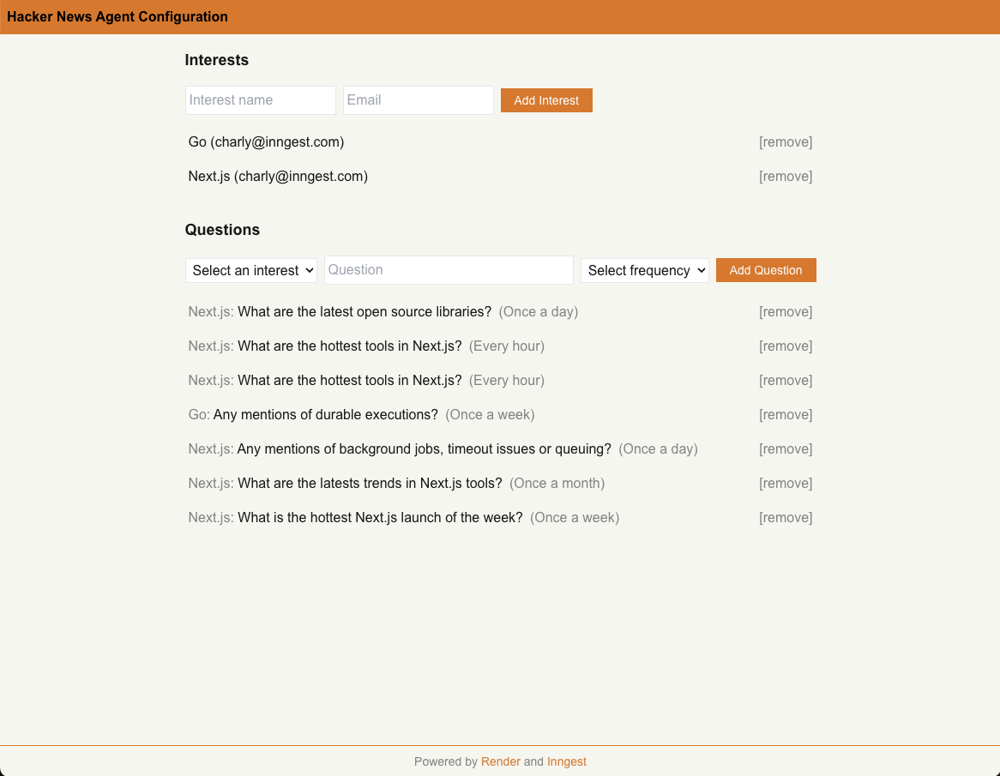

# Hacker News Agent with Render and Inngest

<p align="center">


</p>

<p align="center">
    <a href="https://www.render.com/docs/">Render docs</a>
    <span>&nbsp;·&nbsp;</span>
    <a href="https://agentkit.inngest.com/overview?ref=render-hacker-news-agent-repository">Inngest Agent Kit docs</a>
</p>
<br/>

Learn how to build and deploy a Hacker News agent with Inngest, Render, and Next.js.

This Hacker News Agent enables you to enter some interests such as Next.js or Serverless along with a set of questions. Each question get assigned to a frequency at which the AgentKit Network will be triggered to summarize to answer the question based on the latest Hacker News stories fetched by the indexer.

## Table of contents:

- [Deploying this project on Render](#deploying-this-project-on-render)
- [Modifying or running the project locally](#modifying-or-running-the-project-locally)

## Project Structure

- `packages/app`: Next.js application with the Hacker News agent configuration UI and its Inngest AgentKit Network
- `packages/indexer`: A Cron Job that indexes Hacker News content into a Render Postgres vector database

## Deploying this project on Render

### Prerequisites

To deploy this project on Render, you need to have the following accounts:

- [Render account](https://render.com/)
- [Inngest account](https://inngest.com/?ref=render-hacker-news-agent-repository)
- [OpenAI account](https://platform.openai.com/)
- [Resend account](https://resend.com/)

### 1. Set up the Postgres vector database

_The Postgres vector database is used to store the Hacker News stories and to serve as the vector database for the AgentKit Network._

<br/>

To set up the Postgres vector database, you need to create a new Postgres database on Render and initialize it with the provided schema.

1. [Create a Project on Render](https://render.com/docs/projects#setup).

2. Then, from your project, [Create a new Postgres database on Render](https://render.com/docs/postgresql-creating-connecting#create-your-database).

3. Initialize the database with the provided schema

First, you'll need to clone this project locally to get the schema.sql file.

Then, to initialize the database with the provided schema, copy the psql command provided from the [Postgres database dashboard (for external connections)](https://render.com/docs/postgresql-creating-connecting#external-connections) and run it in your terminal as follows from the root of the project:

```bash
psql -Atx postgresql://<redacted>@<redacted>.render.com/<redacted> -f packages/indexer/schema.sql
```

### 2. Set up the Indexer service Cron Job

_The Indexer service is used to fetch Hacker News stories and to store them in the Postgres vector database._

<br/>

The `packages/indexer` directory contains a `indexer.ts` file that will index Hacker News content into the Postgres vector database.

To set up the Indexer service Cron Job, you need to create a new Cron Job on Render using a Docker image set up with playwright and its chromium binary.

The `docker.io/wittydeveloper/inngest-render-indexer:0.4` image is available publicly on Docker Hub for this project:

1. [Create a new Cron Job on Render](https://render.com/docs/cronjobs#setup) using the "Existing image" option by pasting the image URL `docker.io/wittydeveloper/inngest-render-indexer:0.4` in the "Image URL
   " field.
2. Configure the _Schedule_ to run on a daily basis: `0 0 \* \* \*`.
3. Configure the following environment variables:
   - `DATABASE_URL`: The URL of your Postgres vector database ([from the Connect button on the Postgres database dashboard](https://render.com/docs/postgresql-creating-connecting#external-connections)).
   - `OPENAI_API_KEY`: Your OpenAI API Key.

You are good to go!

### 3. Set up the Next.js app and AgentKit Network

_The Next.js app and AgentKit Network is used to serve as the frontend to configure the Hacker News agent and as backend to run the AgentKit Network._

<br/>

The `packages/app` directory contains a Next.js application that will serve as the frontend for the Hacker News agent.

To set up the Next.js app and AgentKit Network, you need to create a new Web Service on Render and configure it to run the Next.js application.

1. [Create a new Web Service on Render](https://render.com/docs/web-services#deploy-from-github--gitlab--bitbucket) using the "Public Github repository" option by pasting the repository URL `https://github.com/wittydeveloper/inngest-render-hacker-news-agent` in the "Repository URL" field.
2. Configure the _Root Directory_ to `packages/app/`.
3. Configure the _Build Command_ to `pnpm install; pnpm build`.
4. Configure the following environment variables:

   - `DATABASE_URL`: The URL of your Postgres vector database ([from the Connect button on the Postgres database dashboard](https://render.com/docs/postgresql-creating-connecting#external-connections)).
   - `INNGEST_EVENT_KEY`: The [Event Key of your Inngest project](https://www.inngest.com/docs/events/creating-an-event-key?ref=render-hacker-news-agent-repository).
   - `INNGEST_SIGNING_KEY`: The [Signing Key of your Inngest project](https://www.inngest.com/docs/platform/signing-keys?ref=render-hacker-news-agent-repository).
   - `OPENAI_API_KEY`: Your OpenAI API Key.
   - `RESEND_API_KEY`: Your Resend API Key.
   - `APP_PASSWORD`: The password to access the app.

You are good to go!

### 4. Try it out!

To try it out, go to your Render Web Service dashboard and copy the URL of your web service (ex: https://agenkit-render-tutorial.onrender.com).

The following page should be displayed:



## Modifying or running the project locally

Install dependencies by running the following command from the root of the project:

```bash
pnpm install
```

### Indexer (`packages/indexer`)

**Run the indexer locally**

> Note: You'll need to set up the `.env.local` file.

```bash
pnpm build

pnpm start
```

**Push a new Docker image version**

Example:

```bash
docker build -t docker.io/wittydeveloper/inngest-render-indexer:0.5 .
docker push docker.io/wittydeveloper/inngest-render-indexer:0.5
```

### Next.js app (`packages/app`)

> Note: You'll need to set up the `.env.local` file.
> Don't forget to set the `APP_PASSWORD` password

**Run the Next.js app locally**

```bash
pnpm dev
```

**Start the Inngest Dev Server**

```bash
npx inngest-cli@latest dev
```
